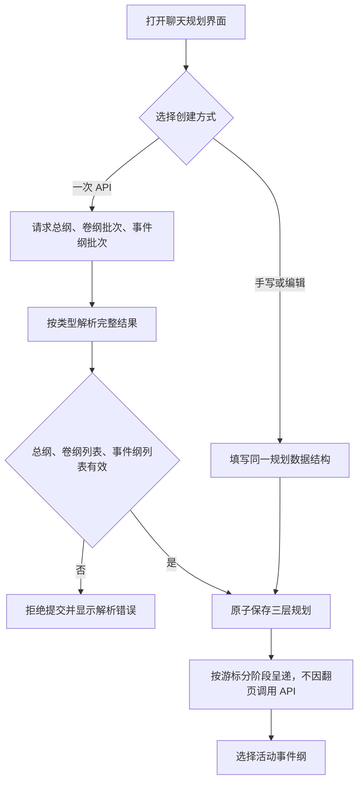
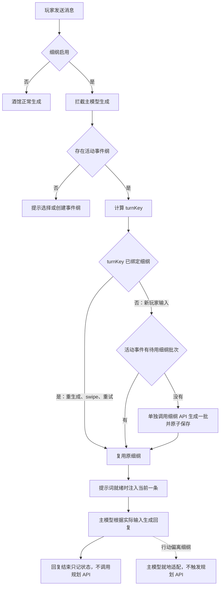

# 剧情规划器：总纲、卷纲、事件纲与细纲批量通路

> 状态：第一阶段代码已在本地实现并通过 Node 测试；仍需在实际 SillyTavern 宿主中验收 UI 与生成拦截。
> 目标：一次 API 请求生成总纲、卷纲批次和事件纲批次；细纲另用 API，按活动事件生成一批。

> 预设：沿用同一份 API 连接配置与预设目录，但分别保存“上层三纲预设”和“细纲预设”的活动预设 ID；旧版单一活动预设迁移时暂时同时填入两者，之后可分别切换。

## 调用边界

1. **上层规划调用**：在规划界面中一次 API 调用，生成一份简洁总纲、多个卷纲和多个事件纲。结果按类型分别解析、完整校验并原子保存。玩家也可以手写或编辑这三层，进入相同的数据模型。
2. **细纲批次调用**：独立于上层规划 API。酒馆主模型生成前，基于当前活动事件纲，一次 API 调用生成多个细纲并保存；每次主模型请求只注入当前的一条。

各层批次生成完成后按游标逐阶段呈递，呈递下一项不再次调用 API。结果页显示当前卷纲和事件纲，并可分别推进；两个游标没有代码强制关联。事件纲和卷纲可以在游玩规划中有关联，但代码不要求事件纲必须属于某个卷纲，也不以该关系阻止生成、保存或游玩。

玩家行动与细纲不同本身不触发规划 API。酒馆主模型按实际对话处理行动。助手回复结束后只更新细纲使用状态，不生成下一批细纲。

## 最小数据模型

```text
ChatPlanningState (保存在现有聊天规划变量中)
  upperPlan
    revision, premise, volumes[], events[]
    activeVolumeId, activeEventId
  fineBatchQueue[]                活动事件剩余细纲
    batchId, batchIndex, eventId, eventRevision, signature, fullTag, body
  outlineHistory[]                已分配给具体回合的细纲
    turn key, input fingerprint, eventId, eventRevision, batchId, status
```

- `source` 记录 `manual` 或 `api`；手写和 API 生成结果使用同一数据结构。
- 上层 API 响应含总纲记录和卷纲、事件纲数组。代码按类型解析，不校验事件纲是否挂在卷纲之下。
- 细纲批次绑定 `eventId`、`eventRevision` 和状态签名；所依据的活动事件被编辑、替换或切换后，未使用的旧批次不再注入。
- 规划数据、批次游标和活动项按聊天保存；API、模型和预设设置继续使用现有全局配置。
- 每次 API 结果先在临时状态中完整解析和校验，再原子提交，避免出现半份上层规划或半批细纲。
- 旧版本单条细纲记录保留为旧历史，不自动猜测其所属事件；新流程只注入明确绑定到当前事件的批次。

## 上层规划：一次调用生成三层

上层规划由规划界面的显式操作触发，不占用酒馆主模型的生成拦截器。它使用上层三纲预设发出一次请求，要求响应包含一个 `<premise>...</premise>`、多个 `<volume>...</volume>` 和多个 `<event>...</event>`。代码完整解析后把三类结果整批保存；手写路径直接写入相同字段。细纲使用独立预设并在生成拦截器触发另一次 API 请求。



卷纲可以较简洁，事件纲可以展开成多个阶段。事件纲的卷归属由游玩流程决定，代码不创建必须的父子外键或完整性门槛。

## 细纲批次：独立 API、生成前注入

1. 普通酒馆生成开始时，扩展在生成拦截器中读取当前聊天、活动事件和最新玩家输入。
2. 根据聊天身份、活动事件版本和玩家输入计算稳定 `turnKey`。
3. 若相同 `turnKey` 已绑定细纲，则复用，覆盖重生成、swipe 和重试。
4. 若为新 `turnKey`，取活动事件批次中的下一条。该事件版本没有有效批次时，在本次主模型回复生成前调用细纲 API，生成多个细纲并保存整批。
5. 提示词就绪事件中只注入当前细纲，然后放行主模型。
6. 回复结束后只记录使用状态和回复楼层，不调用规划 API。下一个不同的 `turnKey` 才分配下一条。

细纲关闭时绕过门控，酒馆正常生成。细纲开启但没有活动事件纲时，提示用户选择或创建事件；用户也可关闭细纲继续生成。



### 推进和失效

- 新玩家输入分配下一条细纲；相同输入的重生成、swipe 和重试复用同一项。
- 主模型生成失败或被停止时，不消耗细纲项；重试继续复用该 `turnKey`。
- 当前事件的细纲批次耗尽后，游玩流程可切换到另一个已规划事件；该事件没有有效细纲批次时，下一次主模型生成前再单独生成一批。
- 若需要为同一事件追加/替换细纲，走显式重规划操作；玩家行动未按细纲发生不是重规划条件。
- API 任务绑定 `chatId`、状态版本、活动事件 ID 和事件版本。切换聊天、活动事件编辑或替换会取消过期任务，迟到结果不得写入当前状态。

## 代码改动顺序

### 1. 预设角色与批次解析

- 为上层三纲和细纲分别持久化活动预设 ID，并兼容迁移旧版 `activePlannerPresetId`。
- 细纲 API 结果允许包含多个完整 `<outline>`，整批解析校验后再入队。
- 不改变 API 地址、模型和密钥的共享配置。

### 2. 上层规划批次

- 在当前聊天状态中加入总纲、卷纲数组、事件纲数组和各层呈递游标。
- 在规划界面显式触发上层 API；一次使用上层三纲预设请求并解析三类结果；手写/编辑路径写同一结构。
- 只校验三类数据结构完整，不要求事件纲指向卷纲。
- API 结果整批校验通过后一次提交。

### 3. 事件下的细纲批次

- 生成拦截器只使用细纲预设；细纲规划请求带上当前活动事件纲。
- 新增 `ensureFineBatch(eventId)`，仅供生成拦截器调用；有效批次存在时复用。
- 用 `turnKey → fineItemId` 绑定当前玩家输入，避免重生成或 swipe 消耗下一项。
- 活动事件版本改变时，旧批次退出可注入集合。

### 4. 生成生命周期

- 主模型生成前确保细纲批次并注入当前项；API 失败时阻止本轮主模型回复，不推进游标。
- 回复结束后只确认使用记录和实际楼层，移除 `phase: next` 等回复后规划 API 路径。
- 保留现有聊天身份、楼层快照对账、任务取消、持久化和迟到结果保护。

## 最小验收

1. 上层三纲和细纲各自选择预设；旧设置迁移后仍可运行，之后两种预设可分别切换。
2. 一次上层 API 请求返回一份总纲、多个卷纲和多个事件纲；批次完整保存并能逐阶段呈递。
3. 手写/编辑的三层结果与 API 结果使用同一聊天状态结构。
4. 事件纲不要求有关联卷纲也能保存、激活并生成细纲。
5. 活动事件下没有有效细纲批次时，主模型生成前单独调用一次细纲 API 生成一批；有有效批次则复用。
6. 同一玩家输入重生成、swipe、重试复用同一细纲；新输入才分配下一项。
7. 回复结束后不调用细纲 API；行动偏离也不调用规划 API。
8. 停止、失败、切换聊天或事件版本改变时，不推进游标或提交过期结果。

## 暂缓范围

- 总纲、卷纲、事件纲之间的强制代码父子关系。
- 玩家行动偏离时自动重规划。
- 对四层规划器整体 UI、预设措辞或宿主适配层做大规模重构。
