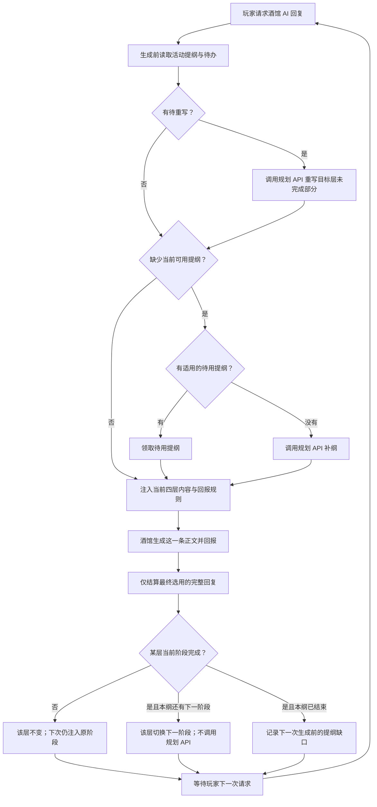

# 变量剧情器最新方案

> 状态：四层规划、阶段结算、生成前补纲／重写与新结果页已按本方案落地。重写后受影响下层的细化范围和对应提示词设计仍可继续完善。
> 目标：规划器保存四层提纲，按卷纲、事件纲、细纲各自的阶段推进；酒馆正文回报阶段完成情况，也可以报告某层提纲需要重写。

## 一句话流程

`生成或编辑提纲 → 注入当前各层阶段 → 酒馆写正文并回报完成情况或重写请求 → 规划器结算完成回报或记录待重写 → 玩家下次请求酒馆回复前，按需拦截并调用 API 生成新提纲`。

规划器不是正文事实的唯一来源。玩家输入与最终选用的酒馆回复构成已发生事实；提纲只是未发生部分的方向。回报只能陈述正文已经发生的事，不能直接命令规划器移动游标。

### 每次酒馆回复的流程



图中的“某层”分别对卷纲、事件纲、细纲判断，三层回报可以在同一条正文里同时成立；总纲没有阶段完成回报。**拦截是每次生成前的状态检查，不等于每次调用规划 API。**没有待重写或提纲缺口时，立即沿用当前提纲放行正文。某层阶段未完成，下一轮仍注入该阶段；完成但本纲还有下一阶段，只切换该层注入内容。整份提纲结束后，优先领取同父阶段的待用提纲，缺少时才在下一次生成前调用 API。待重写由本轮回复记录，也在下一次生成前处理；调用失败则不放行正文。

## 提纲结构与职责

新生成和手写输入统一使用下列标签。标签内完整原文保留；卷纲关键事件列表、事件纲及细纲的阶段边界须在首版解析，其他叙事字段可先按文本保存。不要继续把 `<premise>`、`<volume>`、`<event>`、`<outline>` 当作新方案的正式输出格式。

| 层 | 正式标签 | 职责 | 生命周期 |
| --- | --- | --- | --- |
| 总纲 | `<overall_outline>` | 主题、主角起点、主线浅层与深层目标、基调；提供长期方向 | 整个聊天，低频修订 |
| 卷纲 | `<volume_outline>` | 一个卷的方向与关键事件；关键事件列表从上到下就是卷纲阶段 | 一个阶段可包含多个事件纲 |
| 事件纲 | `<event_outline>` | 一件事的目标、核心剧情及多个 `阶段x` | 事件阶段与卷纲阶段不一一对应 |
| 细纲 | `<fine_outline>` | 当前事件下更具体的多个 `阶段x` | 当前细纲走完后可生成下一份 |

四层提纲是范围逐渐缩小的集合：总纲统领卷纲，卷纲当前阶段可以包含多个事件纲，事件纲又由细纲展开。卷纲的一个关键事件与事件纲条数不做一一对应。提纲正文不添加为游标服务的字段；阶段序号和来源版本由规划器另外保存。

内容格式如下。卷纲、事件纲和细纲的字段与顺序采用当前确认的版本；`阶段x` 可以重复出现。`ID` 和修订号由规划器另行保存。

```text
<overall_outline>
核心主题:
主角起点:
主线目标:
  浅层:
  深层:
故事基调:
</overall_outline>

<volume_outline>
卷名:
本卷定位:
本卷目标:
核心剧情:
关键事件:
  -
  -
结尾收束:
</volume_outline>

<event_outline>
事件名:
事件定位
事件目标:
核心剧情:
阶段x:
  阶段目标:
  核心情节:
  结尾收束:
</event_outline>

<fine_outline>
阶段x:
  剧情目的:
  时间:
  地点:
  核心情节:
  结尾收束:
</fine_outline>
```

卷纲按“关键事件”的列表顺序推进：第一项是阶段一，第二项是阶段二，依此类推。事件纲和细纲各自按 `阶段x` 的顺序推进。三层游标独立；某个事件纲完成，不自动把卷纲当前阶段标为完成。

## 规划调用

1. **开局自动规划**：保留现有“0 楼开场后的首次正常生成”触发点。现有代码在此时自动生成初始细纲；新流程在缺少上层规划时先生成并校验上层提纲，再准备当前细纲，然后放行正文。单纯查看 0 楼不发 API 请求，手动生成与编辑仍可用。
2. **批次补充**：规划 API 可以保存多份待用提纲，但同一时刻每层只激活一份。当前细纲的全部阶段走完且上层未结束时，补充细纲；当前事件纲的全部阶段走完时，按卷纲当前阶段补充事件纲及细纲；卷纲“关键事件”全部走完时，补充下一批卷纲及相应下层提纲。若同轮多层耗尽，按最高层缺口合并规划任务，避免重复调用。
3. **重写**：正文模型负责判断提纲是否仍可执行，并回报“是否需要、问题提纲层级、问题说明”。本轮最终回复结算时只保存待重写请求，不立即调用 API。玩家下次让酒馆 AI 回复前，由生成拦截先按当前剧情重写目标提纲的未完成部分，再重写受影响的活动下层提纲与待用下层提纲，然后注入当前有效阶段并放行正文。受影响范围与具体提示词拼接留待后续预设设计。若 API 失败，保留待重写请求并阻止本次正文生成；下次请求仍可重试。本稿不沿用旧稿中的“审查／驳回”字段。

批次列表是规划器保存的**提纲数据**，不是正文回报变量。卷纲可以有多份已生成或历史记录，但正文每轮只针对一份当前卷纲回报阶段完成与否。

## 规划器独立变量

当前确认的首版**阶段完成回报**有三个布尔值，没有“故事导演”或“本轮回报”外层，也没有模式、关键事实、游标等字段：

```yaml
卷纲:
  阶段完成: false
事件纲:
  阶段完成: false
细纲:
  阶段完成: false
```

每项只表示**本轮注入的该层当前阶段**是否已经在正文中完成。每轮先从 `false` 开始；酒馆确实写完时回报 `true`。规划器把回报与当前聊天、当前提纲及最终选用的助手回复绑定，结算后不把旧 `true` 带到下一轮。

提纲原文、批次列表、活动提纲 ID、三个阶段游标、已用回复记录、两个“上层待推进”标记及待重写请求都由规划器内部保存；它们不属于正文回报变量，也不允许酒馆用 `set` 直接修改。总纲没有阶段完成回报。

**重写回报**与三种阶段完成回报并列。重写可以指向任一提纲层级，因此不嵌套在细纲之下，也不在卷纲、事件纲、细纲中重复定义：

```yaml
卷纲:
  阶段完成: false
事件纲:
  阶段完成: false
细纲:
  阶段完成: false
重写:
  需要: false
  问题提纲: "" # 需要重写时填写：卷纲、事件纲、细纲
  问题说明: ""
```

正文模型分别报告卷纲、事件纲、细纲的当前阶段是否完成。`重写.需要: false` 时，“问题提纲”和“问题说明”留空；为 `true` 时，“问题提纲”必须填写卷纲、事件纲或细纲之一，“问题说明”须写清提纲中有问题的内容、当前已发生事实或玩家选择如何使它不成立、无法就地调整的原因，以及重写后应保留的目标。一次回报指定一个问题提纲；如果上层提纲的问题使下层也失效，指向有根本问题的上层。玩家正在走日常、当前阶段尚未完成或执行方式有所变化，都不单独构成重写理由。重写路径使用白名单 `set`；自由文本用双引号包裹，并遵循 JSON 字符串转义规则。

## 正文回报协议

本轮注入一份简短的更新规则。酒馆在最终正文末尾输出 `<planner_update>`；首版只解析三种阶段完成路径和三种重写路径：

```text
<planner_update>
set(细纲.阶段完成, true)
set(事件纲.阶段完成, false)
set(卷纲.阶段完成, false)
set(重写.需要, true)
set(重写.问题提纲, "事件纲")
set(重写.问题说明, "玩家选择改变了事件前提；保留已经发生的救援结果。")
</planner_update>
```

阶段完成项缺失时按 `false` 处理。重写项使用 `重写.需要`、`重写.问题提纲`、`重写.问题说明` 三条白名单路径；需要重写时，问题提纲只能是卷纲、事件纲或细纲，问题说明为必填自由文本；不需要重写时，问题提纲和问题说明留空。自由文本使用双引号及 JSON 字符串转义（例如 `\n` 表示换行）。规划器拒绝白名单之外的路径和类型，不把 `set` 当作任意变量写入。`true` 是正文模型的完成回报；规划器需要核对它属于当前最终回复及当前提纲版本，但单靠解析无法证明剧情内容在语义上确已完成，这一点留作后续验收。

## 回复后的决策顺序

1. 确认这是一条完整的、最终被选用的助手正文；停止、失败、工具中间消息不结算。
2. 将三项布尔回报绑定玩家输入、选用的回复、聊天和对应提纲修订号；同一最终回复只结算一次。
3. `细纲.阶段完成: true` 时进入细纲下一 `阶段x`。当前细纲的全部阶段结束且事件阶段未结束时，自动补充细纲。
4. `事件纲.阶段完成: true` 时进入事件纲下一 `阶段x`；如果当前细纲尚未收尾，先记“事件阶段待推进”，等细纲结束再执行。事件纲的全部阶段结束后，可以在卷纲的**同一个**关键事件阶段下继续生成新的事件纲；不自动完成卷纲阶段。
5. `卷纲.阶段完成: true` 时进入“关键事件”列表下一项；如果当前事件纲尚未收尾，先记“卷纲阶段待推进”，等事件纲结束再执行。卷纲全部关键事件结束后，自动补充下一批卷纲及相应下层提纲。
6. 同轮多个层级完成时，先处理细纲，再处理事件纲，最后处理卷纲；所需规划 API 任务按最高层缺口合并。三个回报值在结算后重置为 `false`。
7. `重写.需要: true` 时，把目标层级、完整问题说明、当前提纲版本与最终选用的回复绑定，记为待重写。已经写进正文的完成事实和已完成阶段保留；目标层以下受影响的活动提纲与待用提纲都应重写。哪些下层受影响，以及如何把目标层、既有事实和下层内容拼入规划预设，留待后续设计。若同轮完成回报与同一层的重写请求互相矛盾，不自动推进该层；其他已发生的事实仍须保存。

“待推进”和“待重写”都是规划器内部标记，不要求酒馆另报变量。若三层阶段都未完成且不需要重写，就维持当前位置；玩家可以连续多轮走日常，不提示停滞、不按轮数自动推进，也不因此调用规划 API。收尾使用事件纲、细纲现有的“结尾收束”；首版不加“后日谈／余波”回报。

## 注入到酒馆提示词的位置

每轮只发送与当前回复有关的内容，分成两个消息块：

1. **稳定规则块**：规划是方向；必须承接玩家行动、尊重已发生事实和角色有限视角；仅当相应阶段确实写入正文时回报 `true`。解释三个 `<planner_update>` 布尔值的含义。用独立 `system` 消息放在角色/世界基础说明之后。
2. **动态状态块**：总纲简要方向、当前卷纲的关键事件、当前事件纲阶段和当前细纲阶段。以独立 `system` 消息放在最近聊天记录附近，尽量位于最新玩家输入之前。不注入待用批次和旧版提纲。

若宿主最终组装顺序不能稳定插在玩家输入之前，优先保证同一请求中规则块与动态块各出现一次，并在发送前检查实际消息数组顺序。当前实现把 `<outline>` 直接追加到 `event.chat` 末尾；正式改造需要检查目标 SillyTavern/TauriTavern 版本里的实际请求体及其他扩展/预设的转换。提示词“位置”以最终发出的消息顺序为准，不以面板显示位置为准。

日常、暂停与恢复主线仍是目标流程，但不添加新的回报变量；其进入和退出方式另行设计。正文模型判断更高层提纲是否合理所需的额外注入依据留待后续校正。正文中的 `<planner_update>` 是否需在屏幕上隐藏，应与现有正则及宿主渲染管线分别验证；隐藏显示不等于没有保存到原始回复。

## 重生成、改稿与持久化

- 同一玩家输入重试和 swipe 复用同一细纲阶段，不领取下一阶段。只有最终选用的回复可以产生有效结算。
- 待重写请求只属于产生它的最终选用回复及当时的提纲版本。若玩家重生成、改选 swipe、编辑或删除该回复，撤销旧分支的待重写请求；下一次生成前以当前选用分支重新核对。
- 如果用户改选旧 swipe、编辑或删除已结算回复，应撤销受影响回复之后的派生结算，并从仍存在的选用回复按顺序重放；无法安全重放时暂停自动推进，请用户确认当前节点。不能在旧状态上直接反向 `set`。
- 当前聊天与配置切换、提纲修订或任务取消后，迟到的 API 结果不得提交。保存失败时保留待写状态与错误提示，下轮生成前先恢复一致性。
- 历史中的完成事实与旧提纲版本保留；当前细纲依据过期时使它失效，再生成适用的版本。每条记录带可核对的聊天、输入、回复和修订号。

## 对照当前项目的改造方案

现有扩展的原生生成拦截、规划 API 请求、按聊天保存、最终回复识别和重生成对账可以继续使用。核心语义要从“每个玩家回合消耗一条 `<outline>`”改为“卷纲、事件纲、细纲各持有一个活动阶段；正文回报完成才移动对应阶段”。这不是更换宿主或另起一个规划器。

| 当前实现与位置 | 保留的能力 | 按新方案修改 |
| --- | --- | --- |
| `planner.js` 的 `extractUpperPlan`、`extractOutlineBatch`（约 905–965 行） | 从 API 文本中提取多份提纲并校验标签 | 改用四种 `*_outline` 标签。首版就解析卷纲 `关键事件` 列表、事件纲和细纲重复的 `阶段x`，形成有序阶段数组；保留完整原文供展示和注入。空阶段、标签交错、缺少必需阶段应报错，不保存半份结果。 |
| `saveUpperPlanDraft` 与 `upperPlan`（约 3805 行） | 提纲 ID、修订号、手写和 API 两种来源 | 改为总纲一份、卷纲/事件纲/细纲有序批次和活动节点。事件纲记录所属的**卷纲阶段 ID**，细纲记录所属的**事件纲阶段 ID**；不能再仅用两条独立的 `activeVolumeId`、`activeEventId` 表示关系。手动切换上层节点时也要重新核对并失效不匹配的下层待用提纲。 |
| `target`、`valid`、`allocateQueuedOutline`、`ensureCurrent`（约 2879–2944、3274 行） | 输入指纹、批次、重复请求保护 | 提纲有效性由聊天、节点修订及父阶段决定，不再由“本次玩家输入 + API 配置签名”决定；输入指纹只用于本轮注入/回报归属。同一细纲阶段可以跨多轮复用，`fineBatchQueue` 只在**整份细纲**的所有阶段完成后取下一份。配置改变本身不使已经采纳的提纲失效。 |
| `onMessage`、`reconcileMessages`（约 2948、3302 行） | 最终助手回复、swipe/编辑/删除后的使用记录对账 | 从最终选用回复解析白名单回报，保存“回复身份 + 提纲修订 + 回报 + 结算效果”；对账时撤销失效分支后的结算并重放仍有效的选用回复。`outlineHistory.status=used` 不能代替“阶段完成”。 |
| `generation-gate.js` 的 `interceptor`、`onPromptReady`（约 45–97 行） | 正文前等待规划、失败阻止正文、宿主注入时机 | 改为先处理有效待重写，再补齐当前层缺失提纲，再注入规则和当前活动阶段。`validOutline` 与单个 `fullTag` 改成当前计划快照校验和提示词组合；不能继续只在 `event.chat.push` 追加一条旧 `<outline>`。实际插入位置须用目标宿主的最终请求体确认。 |
| `generateUpperPlan`、`runJob` 及现有请求组装（约 3419、3868 行） | 预设、API 配置、超时、取消、静默请求 | 按任务目的生成初始四层、细纲补充、事件纲补充、卷纲补充或指定层重写。开局缺上层提纲时，首次正常正文生成应自动生成；当前代码的上层三纲主要是手动触发，不能把“已有细纲自动生成”等同于“四层自动规划”。 |
| 面板与现有测试 | 手动编辑、请求预览、API 诊断、宿主门控测试 | 面板显示当前卷纲关键事件序号、事件纲和细纲阶段序号、所属关系、待重写目标及错误；手动编辑和 API 输出走同一解析。测试从“新输入领取下一条”改为“完成回报推进”，并保留宿主门控与分支对账测试。 |

### 数据分别由谁保存

酒馆正文只写已确认的三项 `阶段完成` 和 `重写` 回报。以下是**扩展内部状态示意**，不属于 `set` 路径，也不注入为正文可写变量：

```yaml
规划器内部:
  总纲: {节点ID, 修订号, 原文}
  活动卷纲: {节点ID, 修订号, 当前关键事件序号}
  活动事件纲: {节点ID, 修订号, 所属卷纲阶段ID, 当前阶段序号}
  活动细纲: {节点ID, 修订号, 所属事件纲阶段ID, 当前阶段序号}
  待用批次: {卷纲: [], 事件纲: [], 细纲: []}
  待推进: {卷纲阶段: false, 事件纲阶段: false}
  待重写: null
  回复结算记录: []
```

阶段 ID 由“节点 ID + 节点修订号 + 阶段序号”确定；提纲本身不必增加可见 ID 字段。新事件纲可以连续归属同一卷纲阶段，因此一个卷纲关键事件完成以前能够消耗多份事件纲。每次事件纲规划请求只针对一个卷纲关键事件阶段，每次细纲规划请求只针对一个事件纲阶段；同次响应中的子提纲都归属请求上下文指定的父阶段，父阶段 ID 由规划器保存，不要求正文模型填写。下层批次领取时必须核对父阶段 ID 和修订号；父层重写后，已完成事实和阶段记录保留，受影响的活动及待用后代提纲都应重写。受影响范围与具体提示词拼接留待后续设计。

### 一次正文生成如何走通

1. **生成前拦截**：每次玩家请求正文时只先读取当前选用的聊天分支和内部状态。没有待重写、也没有提纲缺口，就直接使用现有活动阶段注入并放行正文，**不调用规划 API**。若有仍有效的待重写，先调用规划 API 重写目标层的未完成部分及受影响的下层活动/待用提纲，并校验、保存；否则仅在活动提纲已用尽且没有适用待用批次时按最高层缺口补纲。首次正常生成如果上层全空，先生成总纲/卷纲/事件纲，再生成细纲。单纯打开 0 楼不触发 API。
2. **提示词注入**：用同一份活动计划快照构造稳定规则与动态阶段内容，记录三个活动节点的 ID、修订和阶段序号，和本次生成绑定。批次中的待用提纲不注入。一次生成只能取得一份快照；规划请求迟到或聊天切换后不能再注入旧快照。
3. **回复后结算**：只处理完整且最终选用的助手正文。某层当前阶段未完成时，该层阶段不变，下次仍注入相同阶段；三项完成均为 `false` 且无需重写时，保存回报记录但不移动任何阶段，也不调用规划 API。某层阶段完成且同一份提纲仍有下一阶段时，只移动该层游标，下次注入其下一阶段，**不为这次阶段切换调用规划 API**。完成回报按细纲→事件纲→卷纲结算；父阶段先完成而子提纲未收尾时记待推进，子提纲收尾后再兑现。
4. **补纲时机**：某层全部阶段结束只产生“下一次生成前需要补纲”的内部缺口；正文回复结束后不主动请求 API。下一次玩家请求酒馆回复时，拦截器先消费适用的待用批次，没有可用批次才调用 API。同轮多层耗尽，按最高层缺口安排规划，再补足所需下层，避免对旧父阶段生成多余提纲。
5. **重写时机**：最终回复中回报 `重写.需要: true` 仅创建待重写记录。下次正文生成前才调用规划 API；失败则保留待办并阻止正文。重写哪一份由 `问题提纲` 加本次注入快照定位，正文模型无需填写节点 ID 或序号。目标层以下受影响的活动与待用提纲也要重写；具体受影响范围及预设提示词如何提供上下文，留待后续设计。若同轮完成和重写指向同一层而互相矛盾，该层不推进；其他层的已发生事实仍入记录。

### 迁移与首版边界

旧 `<premise>/<volume>/<event>/<outline>` 历史保留可读和可手工处理，不从旧“已使用”推断任何阶段已完成，也不自动将旧平铺事件纲绑定到卷纲关键事件。迁移到新流程时需要用户选定或重新生成活动节点，之后才开启自动阶段推进；旧版本的故事正文不删除。优先让新聊天跑通四层闭环，再提供旧聊天的安全转换入口。

首版沿用原生扩展与现有请求管线，不引入 MVU 或“故事导演”层；`set` 只作为白名单回报协议，自由文本使用 JSON 字符串转义。NPC、势力记录以后作为可选事实来源接入。

## 实施顺序与验收

1. **解析协议与批次归属**：实现四种提纲标签的必需字段与阶段识别规则；按已确认的父阶段上下文保存事件纲和细纲批次归属。验收：一份合法输出能唯一确定所有节点及其父阶段，非法输出能明确报错。
2. **解析与内部状态**：解析新标签及有序阶段，保存完整原文、节点 ID/修订、父阶段 ID、活动游标和待用批次；迁移旧状态但不猜测旧正文进度。验收：手写和 API 输出走同一解析，单个卷纲阶段可绑定多份事件纲，旧聊天历史仍可读。
3. **每轮注入与原地推进**：生成前取得同一份四层活动快照；无待办时直接注入原阶段并放行。最终回复解析三个完成值；`false` 保持原阶段，`true` 且本纲还有下一阶段时只移动该层游标。验收：连续多轮全 `false` 不调用规划 API；完成细纲阶段一后下一轮只换细纲阶段二；事件、卷纲仍按自身回报决定。
4. **跨层结算和补纲**：实现细纲→事件纲→卷纲的结算顺序、两个上层待推进标记，以及“整份提纲用尽→下次请求先领批次→没有才调用 API”。同时补齐 0 楼后的首次正常生成。验收：事件阶段提前完成会等细纲收尾；事件纲结束不自动完成卷纲关键事件；同一卷纲阶段可先后使用多份事件纲；首次回复前可自动准备四层。
5. **回复分支对账**：将每次回报绑定选用回复和活动快照；重试、swipe、编辑、删除时重放有效分支的结算，并处理持久化失败和迟到的 API 结果。验收：同一回复不重复结算；改选回复后不沿用旧分支阶段进度。
6. **重写闭环**：解析重写回报，回复后仅记录待办；下一次生成前重写指定层未完成部分及受影响的活动、待用下层提纲，再注入新版本。受影响范围与预设提示词拼接需在后续预设设计中明确。验收：本轮回报后不立刻调用 API；下次请求时先重写，失败保留待办并阻止正文；swipe 改选后旧待办失效。
7. **界面与宿主验收**：结果页显示四层活动节点、三层阶段、批次及待重写状态，保留手动编辑和请求诊断；在目标宿主核对最终提示词顺序、流式/非流式最终回复、工具中间消息、发送停止及聊天切换。验收以最终发出的请求和真实回复事件为准。

### 已确认与后续设计项

| 事项 | 决定或后续工作 |
| --- | --- |
| **回报语法** | 已确认。保留白名单 `set(路径, 值)`；三项阶段完成值缺省为 `false`；重写使用 `重写.需要`、`重写.问题提纲`、`重写.问题说明`；自由文本用双引号及 JSON 字符串转义。 |
| **批次父阶段归属** | 已确认。每次事件纲请求只针对一个卷纲关键事件阶段，每次细纲请求只针对一个事件纲阶段；同次响应中的子提纲归属于请求上下文指定的父阶段，父阶段 ID 由规划器保存，不要求模型填写。 |
| **重写后的下层提纲** | 原则已确认，具体机制后续设计。重写目标层时，所有受影响的活动与待用下层提纲都应重写，已完成事实和阶段保留。受影响范围如何判断、上下文如何由预设和提示词拼接提供，后续再定。 |

上述回报语法和批次归属已可用于后续实现设计；下层重写的提示词和影响范围规则仍需在规划预设设计阶段补充，不增加正文变量。

真正的宿主验收至少覆盖目标 SillyTavern/TauriTavern 版本中的提示词最终顺序、流式与非流式最终回复、工具中间消息、swipe/删除和聊天切换。离线 Node 测试只能验证纯逻辑，不能证明宿主事件顺序与提示词位置。

## 暂不纳入首版

- NPC、势力关系网与开放世界后台事件引擎；教程中的记录方式留作后续扩展。
- “后日谈／余波”独立回报变量；收尾先使用现有“结尾收束”。
- 仅凭时间或回复数量自动完成当前细纲阶段。
- 让酒馆正文模型直接写规划器内部变量、提纲正文或游标。
